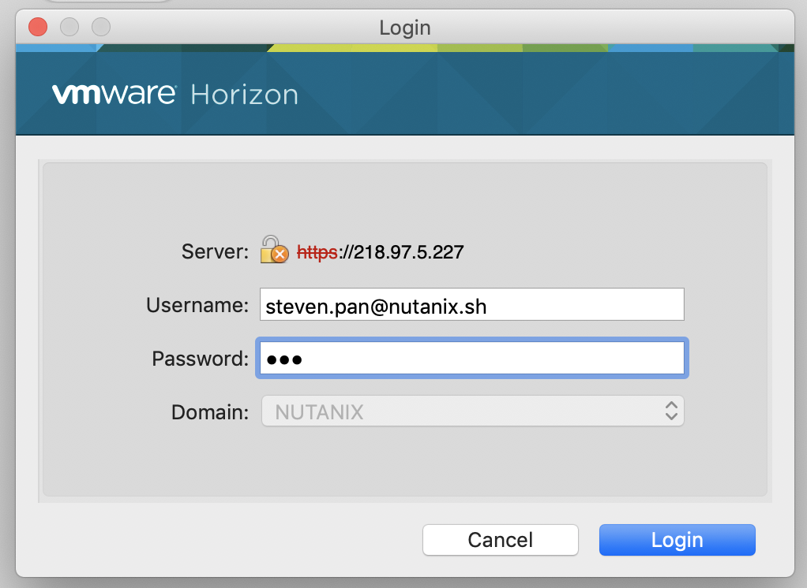

.. title:: lab in shcolo

.. toctree::
  :maxdepth: 2
  :caption: Labs
  :name: _labs
  :hidden:

  calm/sshkey
  kubernetes/importk8s
  kubernetes/kubernetes
  kubernetes/persistentstorage
  kubernetes/podinbp
  blueprint/lamp

.. toctree::
  :maxdepth: 2
  :caption: Appendix
  :name: _appendix
  :hidden:

  appendix/glossary
  appendix/otherstuff

.. _getting_started:

---------------
Getting Start
---------------

You could access SH-COLO with horizon view client.

Labs we have
++++++++++++

- Calm
    - :ref:`sshkey`
- Kubernetes
    - :ref:`importk8s`
    - :ref:`kubernetes`
    - :ref:`persistentstorage`
    - :ref:`podinbp`
- Others blueprints
    - :ref:`lamp`

Access Instructions in SH-COLO
++++++++++++++++++++++++++++++

Horizon View
............

https://218.97.5.227

Preparation before partner workshop
+++++++++++++++++++++++++++++++++++

- create users and put in partner group

    .. code-block:: powershell

        for ($i=1; $i -le 15; $i++) {
          New-ADUser -SamAccountName remote$i -AccountPassword (ConvertTo-SecureString -AsPlainText "1qaz@WSX" -Force) -name "Remote User $i" -enabled $true -PasswordNeverExpires $false -ChangePasswordAtLogon $false
          Add-ADPrincipalGroupMembership -Identity "CN=Remote User $i,CN=Users,DC=nutanix,DC=sh" -MemberOf "CN=partner,CN=Users,DC=nutanix,DC=sh"
        }

- delete users after workshop

  .. code-block:: powershell

    for ($i=1; $i -le 15; $i++) {
      Remove-ADUser remote$i -Confirm:$false
    }

