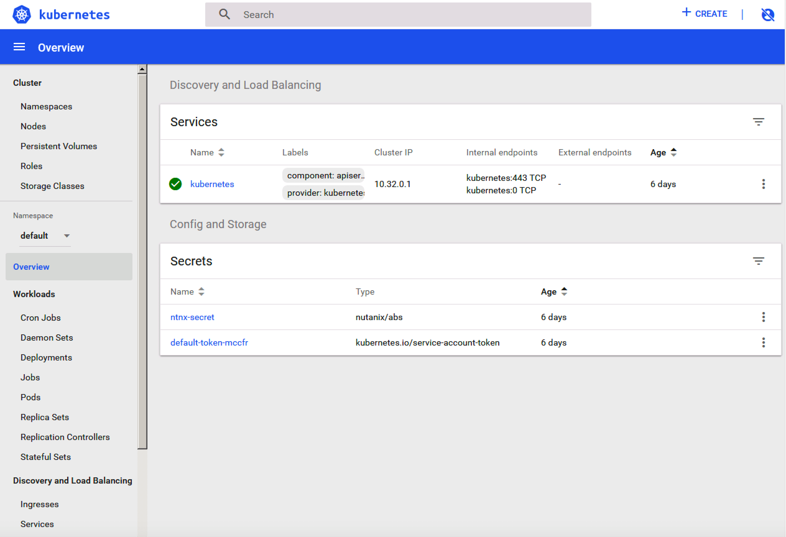

.. title:: LAB: Create Kubernetes Clusterß

.. _kubernetes:

------------------------------
LAB: Create Kubernetes Cluster
------------------------------

Overview
++++++++

Create kubernetes cluster, 3 cotroller node and 3 work node ( about 5 mins )

Create Kubernetes Cluster
+++++++++++++++++++++++++

- Use **firefox** to open open Prism Central URL

    - open https://10.132.129.39:9440
    - username: **nutanix**
    - password: **nutanix/4u**

- Navigate to Calm UI, and find blueprint **COLO_Kubernetes_cluster_BP** in blueprint page

  .. figure:: images/kub1.png

- open this blueprint and launch it from up-right corner

  .. figure:: images/kub2.png

- give a name to this launch, such as **COLO-launch**

  .. figure:: images/kub3.png

- open application you launched and check it after success

  - status is **running**

  - total vm is **6**

  .. figure:: images/kub4.png

- open **service** tab of this launch

  - k8sc - controller node

    - you will find **AHV_Centos_K8SC** means it is Controller node

    - all controller node ip listed blow

    .. figure:: images/kub6.png

  - k8sm - work node

    - you will find **AHV_Centos_K8SM** means it is Minion node ( or work node )

    - all work node ip listed blow

    .. figure:: images/kub5.png

- Find the first controller node **K8SC-0-XXX** and **open terminal**

    .. figure:: images/kub7.png

- Run command to verify, ``kubectl get pod -o wide -n kube-system``

    .. figure:: images/kub8.png

Access Kubernetes Dashboard
+++++++++++++++++++++++++++

Open **firefox**, and access ``https://<any_ip_address_in_your_cluster>:30443/``, it is the default **dashboard** of kubernetes. 
Click **Skip** to skip certifications (if you use **chrome**, maybe will get some issues.)

Now you could create your first container application  :)

Scale Out Work Node
+++++++++++++++++++

- navigate to **application** page, in **manage** tab, click **ScaleOut** when you want to add more work node to your cluster. in this case we add 4 more node to cluster.

    .. figure:: images/kub11.png

    .. figure:: images/kub12.png
        :width: 50 %

- you will find totally 7 work nodes in this cluster

    .. figure:: images/kub13.png

- you could do scale in as you wish

